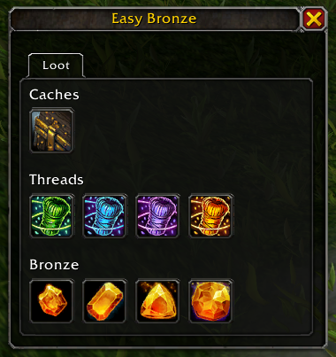
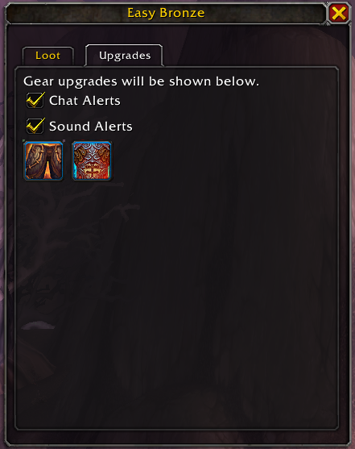

# Easy Bronze

A World of Warcraft - Pandaria Remix utility addon for scrapping items into bronze, opening loot containers, and gear upgrade notifications.

## Features

- Easy loading of the unraveling sands interface.
- Loads gear, filtering out equipment sets and upgrades.
- Loads gems, filtered by configurable stats and qualities.
- Loot interface for easy opening of bronze caches, spools, and gear caches.
- Gear upgrade notifications and equip interface.

## Planned Features

- Gem loadout manager.
- Gem combining.