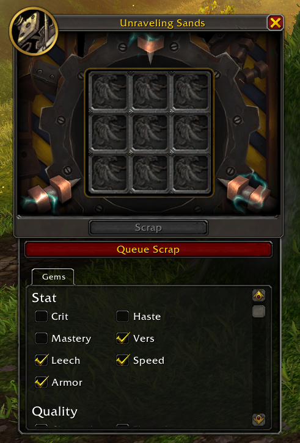

# Easy Bronze

A World of Warcraft addons to aid in the loading of gear and gems into the unraveling sands interface, based on configurable settings.

## Features

- Easy loading of the unraveling sands interface with a click of a button.
- Loads gear.
- Loads gems, filtered by stats and qualities you choose.
- Loot interface for easy opening of bronze caches, spools, and gear caches.

## Planned Features

- Exclude item level upgrades.
- Exclude quality upgrades.
- One button gem combining.